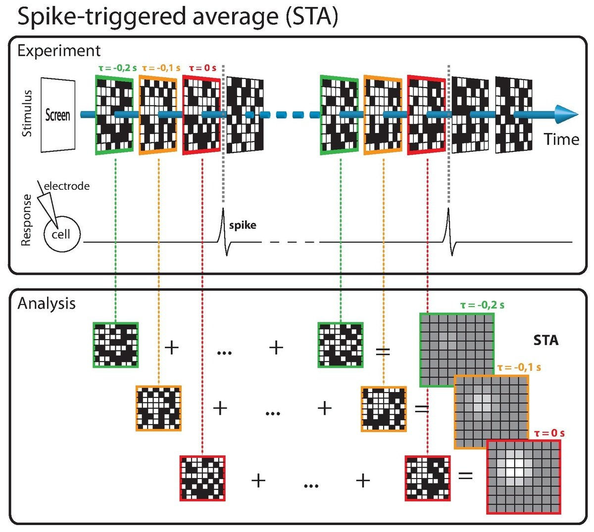
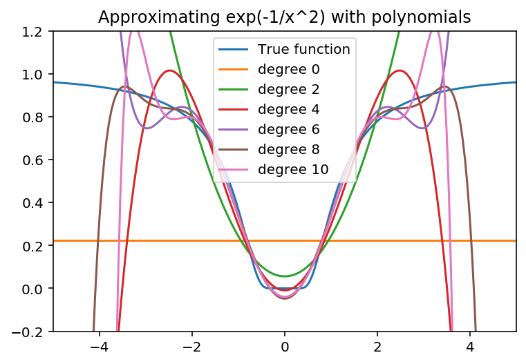
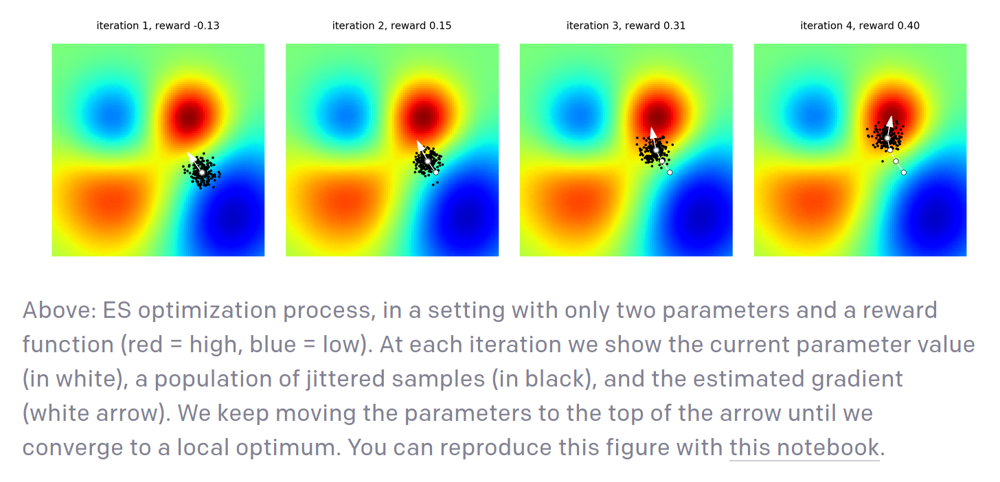
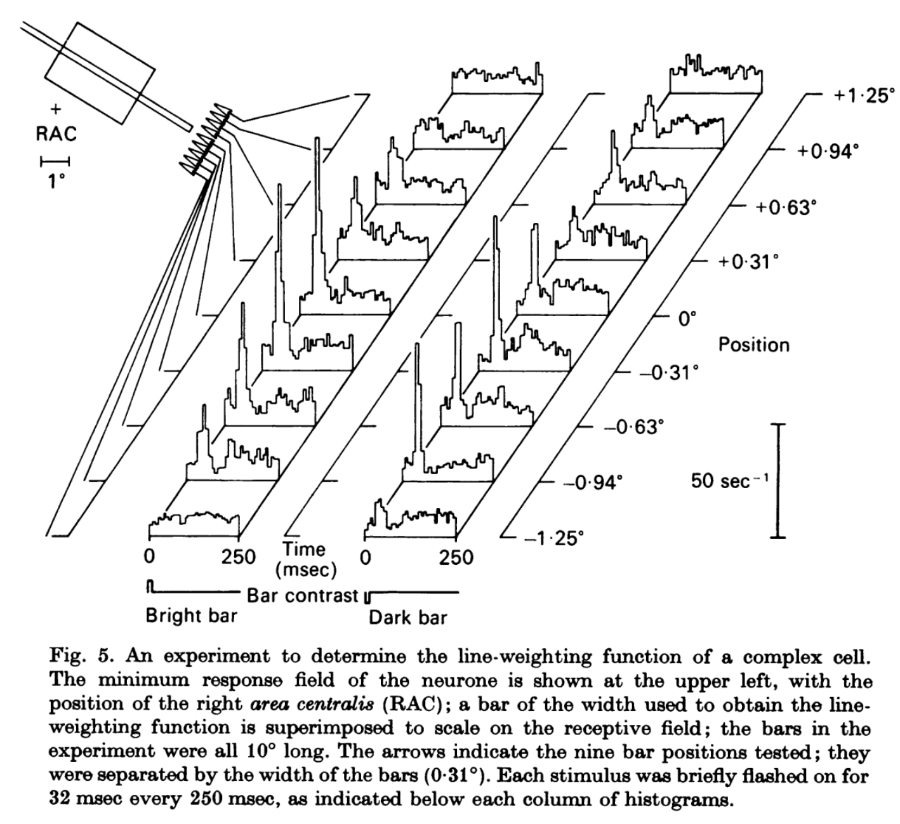

## Reverse correlation: linearizing black box functions

Reverse correlation has long been used to characterize biological neurons. The idea is to open the black box that is a biological neuron by using random stimuli to probe how the neuron responds. We present a series of random stimuli to a sensory neuron. By averaging those that generated a response, the obtain the spike-triggered average. The spike triggered average is equal to the weights of a linear filter that approximates the response of a neuron. Under this linearity assumption, it is also a neuron's preferred stimulus. 

Reverse correlation has fallen out of favor as people have graduated to more complex models (e.g. GLMs and deep nets) with more complex stimuli (natural scenes) to probe brain representations. However, the machinery underlying reverse correlation is making somewhat of an unexpected comeback in different corners of machine learning. This is something that I'm sure will surprise many machine learning people as well as neuroscientists. Digging deeper into these subfields yields some insights on improvements in reverse correlation that we can take back to computational neuroscience. In this article, I discuss two of these ideas:

* evolution strategies, which are black-box optimization methods
* locally interpretable models, which are linearization models to open up black box models like deep neural nets

Before I dig into these methods, let's dig into the theory of behind reverse correlation so we can know its deep structure.

### The theory behind reverse correlation

Reverse correlation seemed pretty magical when I first encountered it! Put noise into a system, measure responses - out comes the kernel (?!). There's a good exposition of the ideas behind reverse correlation in [Franz & Schölkopf (2006)](https://www.mitpressjournals.org/doi/10.1162/neco.2006.18.12.3097). Let's say that we are trying to characterize a nonlinear system that receives $N$ inputs and outputs a noisy scalar $y$: 

$$\mathbb E [y] = f(\bold x) \newline \text{where } \bold x \in \mathbb R^N $$

Then, under certain regularity conditions, we can write the mean response function of the system $f(\bold x)$ as a polynomial expansion, the Volterra expansion:

$$f(\bold x) \approx h_0 + (\bold x - \bold x_0)^T \cdot h_1 + (\bold x - \bold x_0)^T h_2 (\bold x - \bold x_0) + \ldots$$

Note that the kernels $h_i$ have increasing order: $h_0$ is a scalar, $h_1$ a vector, $h_2$ a matrix, $h_3$ a three-index tensor, etc. The form of the expansion is similar to a Taylor expansion, and it's tempting to identify the two. However, the Volterra expansion is more general than a Taylor expansion. For example, the function $f(x) = \exp(-1/x^2)$ has 0 derivatives everywhere. Hence, its Taylor expansion around 0 is exactly 0. However, it has a perfectly good non-null Volterra expansion, which can be found through polynomial regression. [Here's a notebook that shows you how it's done](https://github.com/patrickmineault/xcorr-notebooks/blob/master/Expansion-Schmexpansion.ipynb).

To estimate the coefficients of the Volterra expansion, conventional reverse correlation first rearranges the Volterra expansion into an equivalent series of functionals:

$$f(\bold x) = \sum_i G_i[\bold x]$$

And imposes that these functionals are orthogonal to each other:

$$\mathbb E_D[G_i(x)G_j(x)] = 0 \text{ for } i \ne j$$

Here $D$ is the data distribution. Orthogonality is imposed via a Gram-Schmidt orthogonalization process: 

1. Set $G_0$ to the output of the Volterra kernel of order 0
2. Set $G_1$ to the output of the Volterra kernel of order 1, and back-project $G_0$ from $G_1$ to make $G_1$ orthogonal to $G_0$
3. Set $G_2$ to the output of the Volterra kernel of order 2, and back-project $G_0$ and $G_1$ from $G_2$ to make $G_2$ orthogonal to both, etc.

It turns out that the expectations of every order are straightforward to calculate when the data distribution $D$ is normal. The 0'th order and 1st order functionals are simply the constant and linear Volterra kernels. The 2nd order functional is the quadratic kernel minus a correction for the diagonal terms of the kernel, since the square of a normal distribution has a mean equal to the square of the variance, $\mathbb E[x^2] = \sigma^2$. Thus:

$$G_0 = k_0 \newline 
G_1 = (x - x_0)^T k_1 \newline
G_2 = (x - x_0)^T k_2 (x - x_0) - \sigma^2 \sum_j k_2^{jj}\newline$$

Since each functional are orthogonal over the data distribution, we can easily calculate them using an iterative procedure:

1. Estimate the Wiener kernel $k_0$ from the measured response $y$
2. Project the 0'th order functional out of $y$ to obtain $y_{res}$
3. Estimate the Wiener kernel $k_1$ from the residual $y_{res}$, etc.

What does *estimate* mean in this context? Least-squares! To estimate the zero-order kernel, we have:

$$\hat k_0 = \arg \min_{k_0} \sum(y - k_0)^2 = \bar y$$

For the first-order kernel:

$$\hat k_1 = \arg \min_{k_1} \sum(y - \bar y - (x - x_0)^T k_1 )^2 \newline
= ((x - x_0)^T (x-x_0))^{-1} (x-x_0)^T (y - \bar y) \newline
\approx \frac{1}{N \sigma^2} (x-x_0)^T (y - \bar y)$$

Here the approximate sign comes from the fact that with normally distributed data, $(x - x_0)^T (x-x_0) \approx N\sigma^2 I$. The second order kernel is a little more tricky. We first define $r = y - \bar y - (x - x_0)^T$. Then:

$$k_2 = \arg \min_{k_2} \sum \left(r - (x - x_0)^T k_2 (x - x_0) + \sigma^2 \sum_j k_2^{jj} \right)^2 \newline
= \text{unstack}((D^T D)^{-1} D^T r) \newline$$

The columns of the matrix $D$ is composed of all the cross-products $x_i x_j - \delta_{ij} \sigma^2$ for $i \ge j$. The operator $\text{unstack}$ takes this linear representation of the coefficients and transforms them to a matrix. Here again, we find that for normally distributed inputs, the non-diagonal terms in the covariance matrix $D^TD$ have an expected value of zero. 
The inverse of the diagonal is a bit more tricky to calculate, but a little bit of grinding shows that we pick up a scalar factor $\frac{1}{2!\sigma^{4}}$. In fact, we can show that the estimate of the kernels can be written as:

$$k_i(j_1, j_2, \ldots j_i) = \frac{1}{i!\sigma^{2i}N} [y - \sum_{m=0}^{i-1} G_m(\mathbf x)] x_{j_1} x_{j_2} \ldots  x_{j_i}$$

Where $G_j$ are the orthogonalized Wiener functionals (equation 2, [Korenberg et al. 1988](https://www.ncbi.nlm.nih.gov/pubmed/3382067)). Notice the $i!$ factors, which look an awful lot like what you'd find in a Taylor expansion. [This formula actually works! Here's a notebook to show you how it's done for a second order Wiener expansion](https://github.com/patrickmineault/xcorr-notebooks/blob/master/Second-order-estimate.ipynb).

Is your head spinning yet? Mine sure was! Grinding through the kernels one by one makes a few things clear:

1. Wiener-Volterra analysis isn't magic. It's orthogonal polynomial regression estimated through least-squares, with approximations that are enabled by the use of a very special distribution of the inputs, which means that expectations of different moments can be analytically derived.
2. The Wiener kernel definitions change when you change the distribution of the input. This is because orthogonalization is dependent on the input distribution.
3. The easy estimation of the kernels via backprojection and simple multiplication with cross-products of the inputs is lost when the input distribution is not normal.

Casting Wiener-Volterra analysis as polynomial regression fit via least-squares immediately opens up many extensions:

1. Finding better estimates via the minimum variance unbiased estimator, that is, maximum likelihood
2. Finding better estimates by better modeling the noise, for example, taking into account the Poisson nature of neural noise
3. Generalizing to non-normally distributed ensembles of inputs, again using maximum likelihood
4. Using alternative expansions, for example, cascades of linear-nonlinear filters, fit with stochastic gradient descent

Remarkably, some of the ideas behind Wiener-Volterra theory - local polynomial expansion, probing points randomly - have made their way into far-flung machine learning methods. Let's take a look.

### Evolution strategies (ES)

[Evolution strategies](http://www.scholarpedia.org/article/Evolution_strategies) (ES) are a family of black-box, gradient-free optimizers for potentially non-differentiable functions. The most basic component of an optimizer is the computation of the gradient. If the gradient is unaccessible because of discontinuities, or because it is very expensive to calculate, we can obtain a *smoothed* gradient via NES. 

The setup is quite clever. We have a function $f$ that we are trying to optimize. Instead of computing its derivative $\nabla f(z)$ directly, we compute the derivative of the expectation of the function, $\mathbb \nabla \mathbb E_\pi[f(z)]$ in a local neighborhood $\pi(\theta, z)$. Think of this expectation as a smoothed derivative. 

To compute the expected value, we expand it via its definition, and obtain:

$$\nabla_\theta \mathbb E_\pi(z, \theta)[f(z)] = \nabla \int \pi(z, \theta) f(z) dz \newline = \int \nabla \pi(z, \theta) f(z) dz \newline
= \int \nabla \log \pi(z, \theta) \pi(z, \theta) f(z) dz$$

The last equality, which is also called the [log-derivative trick](http://blog.shakirm.com/2015/11/machine-learning-trick-of-the-day-5-log-derivative-trick/) is derived from:

$$\nabla \log \pi(z,\theta) = \frac{\nabla \pi(z, \theta)}{\pi(z, \theta)}$$

A standard neighborhood which is often used in practice is the isotropic gaussian centered at $\mu$ with a standard deviation $\sigma$. If we take a Monte Carlo estimate of the expectation, we find an approximation for the gradient as:

$$\nabla E[f] \approx \frac{1}{N} \sum_{1}^N \nabla_\mu \log N(\mu, \sigma^2) \newline = \frac{1}{N} \sum_{1}^N 

\frac{1}{\sigma^2} (z-\mu) f(z)$$

Notice this remarkable equation: this is exactly the response-triggered average with an isotropic gaussian stimulus ensemble. Thus, we can view reverse correlation as estimating an approximate gradient of the response function of a neuron. This reveals an unexpected link between reverse correlation and optimization: 

> The response-triggered average tells us how we should change a stimulus locally to increase the response of the system.

#### Taking ES to reverse correlation

The unexpected link between reverse correlation and optimization opens up a lot of different avenues. For instance, we could adapt ES to maximize the response of a neuron in a closed-loop fashion. This strategy has the advantage of being trivial to compute and highly intuitive (i.e. no complaints from reviewer 2 about the method being inscrutable). 

ES is also embarassingly parallel, which has been used [to good effect in the context of reinforcement learning](https://arxiv.org/abs/1703.03864) - OpenAI showcased ES with 1024 parallel evaluations. We could consider evaluating the gradient of a neuron's response function in parallel with another neuron - perhaps in a different animal, in a different lab - and optimize a stimulus that jointly maximizes the sum of the responses. Indeed, we don't have to focus on maximizing just the mean response of a neuron: we can maximize diversity of responses, their dimensionality, etc. This works as long as the metric that we're measuring is a scalar function of the measured responses.

ES comes in a variety of different flavors that aim to increase the efficiency of the method. Two of the most popular variants are:

* [CMA-ES (Covariance-matrix-adaptation)](https://en.wikipedia.org/wiki/CMA-ES). This takes the derivative of the density with respect to the covariance of the normal distribution, in addition to its mean. Thus, the covariance stimulus ensemble is tweaked so the method adapts to capture the largest dimensions of descent.
* [NES (Natural evolution strategies)](http://jmlr.org/papers/v15/wierstra14a.html). This uses natural gradients rather than gradients, which naturally deals with rescaling of the axes. 

Both of these more efficient variants could be applied to find preferred stimuli in a population of neurons. 

Finally, because the ES objective is a Monte Carlo estimate, we can import many of the tricks from the [variance reduction literature](https://en.wikipedia.org/wiki/Variance_reduction) to increase the efficiency of reverse correlation. For example, we can use control variates or use stratified sampling strategies. My favorite trick to increase the efficiency of estimation: pairing every stimulus with its negative. This means that the mean of the realized stimulus ensemble is exactly the mean of the distribution. [This antithetic sampling can, in some circumstances, increase the efficiency of the estimation of the preferred stimulus](https://nbviewer.jupyter.org/github/patrickmineault/xcorr-notebooks/blob/master/Paired-sampling.ipynb).

### Locally interpretable models

There's another area where the ideas underlying reverse correlation have recently come together: [locally interpretable models](https://christophm.github.io/interpretable-ml-book/lime.html). Suppose that we have a complex black box model that we are trying to better understand. This black box model can be, for example, a deep neural network. We can locally approximate this complex function with a simpler, local expansion. This local explanation does not capture all the subtleties of the model, but it can reveal insights that are useful for humans that want to understand the model.

![Toy example to present intuition for LIME.
The black-box model’s complex decision function f
(unknown to LIME) is represented by the blue/pink
background, which cannot be approximated well by
a linear model. The bold red cross is the instance
being explained. LIME samples instances, gets pre-
dictions using f, and weighs them by the proximity
to the instance being explained (represented here
by size). The dashed line is the learned explanation
that is locally (but not globally) faithful. From Ribeiro et al. 2016](reverse-correlation-images/lime-caption.png)

In general, we try to find a model $g$ which approximates a complex function $f$ according to a weight window $\pi$: 

$$\arg \min_{g\in G} L(f, g, \pi) + \Omega(g)$$

Here $L$ is a loss function and $\Omega(g)$ captures the complexity of $g$. [In LIME, or locally interpretable model explanations](), the authors suggest to use a Gaussian-shaped neighborhood around an anchor $a$, and a sum-of-squares loss, leading to the weighted loss: 

$$L = \sum_i \exp \left(-\frac{||x_i - a||^2}{\sigma^2} \right) (f(x_i) - g(x_i)) ^ 2$$

Several choices are possible for $\Omega(g)$. For example, we may privilege functions that focus on few input dimensions; we can impose that $g$ is sparse in parameter space using an L1 penalty as $\Omega(g)$. The model class $G$ can be anything that is "easy to interpret" for humans. This could mean:

* a GAM
* a decision tree
* a linear model

If we choose no penalty for complexity, and choose a linear model class, our model and error function is equivalent to reverse correlation and evolutionary strategies. This highlight something that's underappreciated about reverse correlation:

> The spike-triggered average is a simplified, locally valid explanation for how a neuron works. While complex models like deep nets can capture more of the variance in the data, the goal in reverse correlation is different: explaining neurons to humans.

#### Taking LIME to reverse correlation

An underappreciated fact about reverse correlation is that the size of the neighborhood around which we're linearizing is arbitrary and that different neighborhoods will return different responses. Many articles have documented that receptive fields appear to change with changing stimulus ensembles, for example natural vs. artificial stimuli. However, many of these articles have explained it in terms of some special response of neurons to natural image statistics; for instance, that they increase the degree of feedforward inhibition they receive. In fact, the same phenomenon could happen simply by tweaking the standard deviation of the noise with which we probe neurons. 

In fact, each of these factors is arbitrary:

* the size of the neighborhood (big vs. small)
* the shape of the neighborhood (isotropic Gaussian vs. non-isotropic vs. natural stimuli)
* the center of the neighborhood (gray image or another reference)

Some of the most interesting applications of nonlinear systems identification have played with each of these factors. For example, by shifting the center of the neighborhood to an appropriate anchor point, we can locally linearize quadratic responses (i.e. complex cells) by choosing an appropriate anchor point. This is the idea behind Movshon et al. (1978), where the line weighting function of a complex cell is found by using another line in the center as an anchor:

There are some other excellent nuggets in the LIME paper that could serve us well. For instance, they suggest using a maximally diverse ensemble of examples (SP-LIME) to illustrate the functioning of the models for humans. [A similar idea was used in Cadena et al. (2018) to visualize diverse features](http://arxiv.org/abs/1807.10589) that triggered large responses in early stages of a deep neural net around an anchor point (invariant or equivariant features). 

Finally, we can have our cake and eat it too: we can fit very complex models of neurons that explain much of the variance in sensory systems using deep nets, and visualize how these models work using locally linear explanations. 

### Conclusions

Both ES and LIME use a similar local linearization strategy as reverse correlation. From ES, we learn that the reverse correlation estimate gives us a local approximation for the gradient, which can be used as a starting point for  closed-loop experiments. From LIME, we see that we can perform reverse correlation centered around different neighborhoods, yielding different results. By following these new research trends in machine learning, we can find new innovative ways of opening the black boxes that are biological neurons. 