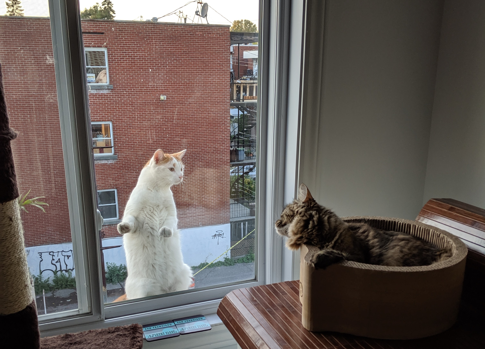

# Should I get a job in industry?

[I explained *how* I got a job in industry previously](getting-job.md). But *should* you get a job in industry? Is is the right thing to do?

## 🎵[The best things in life are free, but you can give them to the birds and bees (I need money)](https://www.youtube.com/watch?v=t5KU34DrrPI)🎵

If you're a postdoc right now, you might be 1) broke or 2) scraping by or 3) slightly better than scraping by. When I came to LA as a postdoc I thought I was going to make bank. Postdocs in the UC system belong to Auto Workers of America union (really!) and are better treated than most. I had dental and might even have had health insurance (although I never used it for lack of need and also because I couldn't quite figure it out as a hapless Canadian). 

At 45k US$ per year, when I signed up for a postdoc I thought I could live a cushy life. Ah! Housing costs are way higher in LA than in Montreal, and you need a car to do anything, which I failed to take into account. I ended up sharing a house with 10 other grad students and postdoc in Westwood without a car (in LA! I definitely did LA wrong). I spent most of what would have been my meager savings in the first year of my postdoc getting my teeth fixed (6 years of grad school, smoking and poor oral hygiene and I had to get double-digit numbers of teeth filled in). After one year I has saved up maybe 1000$ (but my teeth are now pristine).

## Broke vs. sad

With hindsight though, I wasn't broke so much as I was unhappy - unhappy that I didn't make any friends in LA and that my dating prospects were abysmal and that I was alone in the lab. So I ascribed my unhappiness to the fact that I (thought I) was broke, which got externally reinforced since everybody around me (this being LA) said that having money is good and not having money is sad.

By the time I landed a job at Google, I had started meditating and I was reading ethics books which slapped me out of that state - I started thinking that I shouldn't spend my newfound fortune less I fall victim to the hedonic treadmill (Dario warned me about this and he was absolutely right). So I got paid like a Bay Area software engineer (at the time of my hire, about 200k$ total compensation) but was still living substantially like a postdoc. I had roommates and didn't have a car; the only big buy I made was getting LASIK which I immediately regretted because now my eyes get pretty itchy.

In due time I switched from Google to Facebook, and because this was a more specialized position (BCI engineer) I got much more aggressive comp (417k$). I was definitely happier than in my lowest days in LA in both the Google and Facebook jobs. It's easy to think "well that just means you had more money, ergo life was better". However, I was still living mostly a postdoc lifestyle. I had a handful of expensive adventures (swimming with rays in Hawaii, petting domesticated foxes in San Diego). I have many friends who like good food, so I did end up in a lot of Michelin star restaurants which I wouldn't have been able to afford otherwise. But mostly I saved up money and avoided expensive hobbies.

Don't get me wrong, the money definitely helped. I religiously applied the research in the [*If money doesn't make you happy* paper](https://psycnet.apa.org/record/2011-17293-002). Mostly I think I didn't have to worry about being broke anymore and that relieved me. 

Much more important to my well-being was that I also happened to have a much stronger network of friends in SF and a loving girlfriend (then wife). I felt connected to my community. I also had this new concept, the weekend! It's crazy how when you're a postdoc you forget that weekends exist, because you're always doing research. People don't prepare you for how much it sucks to go do a postdoc in a new city and how isolated you are. Getting a job that wasn't a postdoc definitely helped.

## Bay Area streses

However, I got the added stresses of working at a big Bay Area tech company:

* The commute down to the big tech campuses is brutal. Commute length is one of the biggest predictors of quality-of-life. Mid-peninsula and South Bay are super boring places to live (in my opinion), so San Francisco (SF) was the place to be, and that meant 60-90 minutes on the bus each way.
* SF is filled with young-ish tech people, which is great at first (I found my crowd!) but then eventually really sucks (everybody has the same demographics, the same ideas, the same kind of jobs, etc.). You don't see children on the street or old people. Homeless people shit on your front porch and shoot heroin on the street but you don't feel like you can help them because there's so many destitute people that it's overwhelming.
* You start to hate yourself for the ills that giant tech and social networking are bringing to the world. I met a grad student once that refused to shake my hand because I worked for Facebook. I brushed it off saying "I'm only like 10% evil. Here's a picture of my kitten", but I still felt awful after. FB and Google are filled with some of the nicest, most liberal, do-gooder people you have ever met. I sincerely believe that the vast majority of people who work there are individually aligned with altruistic values and also happen to be super smart. Search (spreading knowledge!) and a social network (combat loneliness!) are incredibly valuable things to have out there. But you could have (and people have) written entire books about the unintended consequences of creating those valuable things, for example rigging elections, information bubbles, increasing concentration of wealth, the Bay Area homelessness crisis, people wearing diapers at Amazon fulfilment centers. So I have decidedly mixed feelings. When people ask me about quitting my last job, I always joke that I have a lot more free time on my hands, now that I don't spend a half-hour hating myself in front of the mirror before getting to work. I'm like 70% joking when I say that.
* You start to have nothing interesting to talk about. I felt like my personality was melting. When you're working on research in academia, you will yack anybody's ear off about your research. You can't do that when you're at a profit-making business, so you have to have hobbies and read other stuff unrelated to your job to stay an interesting, well-balanced person. 

For these reasons expect your happiness curve to look like inputting a step function into an RC circuit: pretty soon that capacitor will get discharged and you get back to baseline.

## You can never go home again

For a lot of people, SF is a great place to be in your thirties for a few years, but you have to get out eventually. I met a lot of people in the first months I was in SF -- a few years later, they were all gone. I even had a system to make new friends periodically when people moved out - sign up for an improv class. 18 hours later - you have one new friend and a bunch of new acquaintances. Rinse and repeat. It sounds cynical, but when I shared this with other Bay Area people, I got a lot of nods and approvals.

It took me 4 years to get out of SF and back to Montreal. Montreal is a special place. When I first moved to the US I said to people I was from Canada. I got a few shrugs, so I switched to saying that I'm from Montreal. Oh man - I love Montreal, they would say, I had such a blast partying/going to McGill/etc. 

But Montreal is so much more than that. It's the cultural capital of my people (quebecois). It's a place where being broke is fun - you can walk and take the metro and go to the festivals and wine and dine in the park in the sun for a pittance. It's one of the only places in North America that hasn't fully succumbed to the brutal logic of capitalism - productivity + growth = profit. 

You still find a lot of people that are doing things because it's their passion - artists and artisans and teachers and firefighters. Also people don't find it particularly weird if you tell them you're unemployed, on sabbatical or retired.

At first I didn't know what I wanted to do, so I figured I would do the Tim Ferriss thing and take 6 months off to "explore the world". After talking to a financial advisor I realized that I could extend my sabbatical essentially forever, as long as I was careful.

When I quit my last job, and moved back to Montreal, within a month I felt like a veil was lifted. I could have thoughts which were my own and I was suddenly an interesting person to talk to. I could read books for fun and have rambling conversations with people outside of the productive-professional class (e.g. seniors and high school kids playing pick-up ping pong in the park). I was having smart ideas™ again. I don't think I was depressed before, but I definitely had *ennui*. 

After 6 months of putzing around figuring out what to do with the rest of my life - I tried teaching, a startup, briefly flirted with being a VR artist, I worked on climate change stuff, I wrote again, etc. - I have successfully replaced *ennui* with *existential angst*. Hey, it's an upgrade! I talked to a friend of mine (guy in his seventies, been working in tech since out of grad school) and he told me this: I'm still trying to figure out what I'm going to do when I grow up. The lesson I got from him is: it never ends. You're always going to chase after professional satisfaction and you might never reach it and that's totally okay. 

## Optimizing for the wrong things

My wife is an ophthalmologist, so she spends a lot of time with elders. She often asks them what their biggest regrets are in life, and career stuff almost never comes up. You might think it's just the population of people she dealt with. In SF, she often met with retired professionals, career-oriented people. Career has very little influence on your happiness over your lifetime. As academics we are often taught that the best way to advance our careers is to move far away from home, which is a great way of breaking up meaningful friendships and putting strain in relationships.

When I came, most of the people I knew from Montreal were still there. Some of them were doing great. A lot of them didn't. It seemed like it was mostly orthogonal to whatever career trajectory they had. Some ended up in grad school, graduated, found a job in tech, then fell by the wayside somehow. I met one guy who I did my undergrad with who was getting trashed at a New Year's Eve party - had stayed in Waterloo too long after he graduated, startup this, startup that, was isolated, girlfriend (now ex-girlfriend) was a little unstable, etc. Family problems, undiagnosed mental illness maybe. 

I know it's hard to feel bad about privileged straight white guys in their 30's with graduate degrees, but seriously, a lot of people don't thrive after their PhD. I think it's because the system is set up to convince them that the only way they'll ever be happy is if they do this one thing that's really hard to do, which is make it academia. Then if they decide to do something else and that doesn't work either they feel like failures. Meanwhile their life goes to shit because the fundamentals - health, nutrition, frienships, love - aren't taken care of. That leads to a spiral of depression and I've definitely seen it happen - don't let it happen to you.

# Should I take a job in industry?

I realize this is now more of a rant than a guide to getting an industry job but when people (postdocs) ask me if they should get an industry job it's a long conversation, so if I just have 5 minutes with someone I'll say "sure - they have free food and massage chairs". The reality is that it's a bit of a mixed bag:

* You'll make a lot of money that you can choose to either 1) not spend and retain your freedom or 2) spend and be locked in to a certain expensive lifestyle because of the hedonic treadmill. If you then lose your position and had chosen lifestyle 2) you will end up worse off than when you started.
* You'll have shiny, important looking positions and companies on your CV. This will open doors for you. You may feel bad about working for said companies.
* You might have to move far away from where you are. This will make you happy and sad and stressed and exhilarated. It will wreck havoc on your current friendships and may create new lifelong ones.
* You will learn a thing. That's great! You'll meet a lot of people who are a lot smarter than you are. The voice inside your head that is constantly telling you you're inadequate will start becoming louder and louder. That'll make you feel sad!
* You might be super busy, which will prevent you from thinking about important things (climate change, growing inequality, superintelligence, etc.). This is good! No more worrying! This is bad! No more worrying!

I got out of my postdoc and took a job in industry. With hindsight I think I did that because I was sad (although that wasn't the reason I was giving back then) and it definitely helped but for entirely different reasons you would think. I've also met my fair share of absolutely miserable software engineers during my time at Facebook and Google. And what about new profs? Are they not miserable writing all those grant applications and preparing classes and barely sleeping?

I guess my point is, we suck at figuring out what makes us happy. I spent four years in SF at tech companies and I loved it at first, but by the end I hated it. I met my wife there and made life-long friendships. When I came back to Montreal I had a big nest egg to retire or at least be a forever postdoc (which is what I always wanted TBH). I am in good shape, I have basically no stress in my life, and am almost assuredly better off than I would have been had I continued my postdoc (I probably wouldn't have met my wife in this counterfactual scenario! I might never have found a network of friends in LA!). People return my emails. Life is pretty sweet. Almost none of this was planned. I emphasize this because people like straightforward teleological stories but reality is far more interesting.

So, should you get a job in industry? 🤷 Here's a picture of my cat having a staring contest with  another cat.

