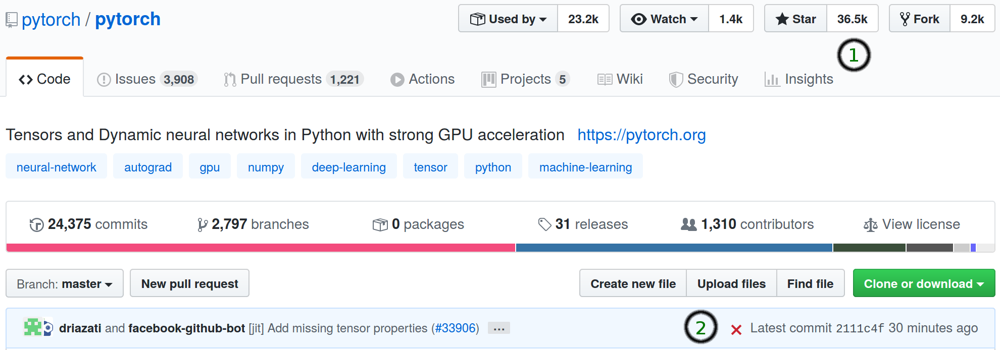
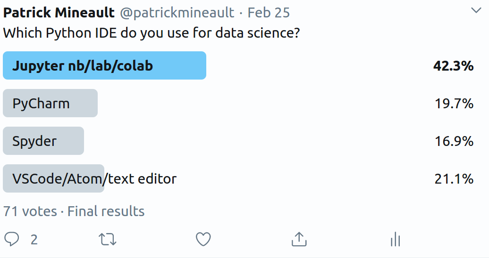
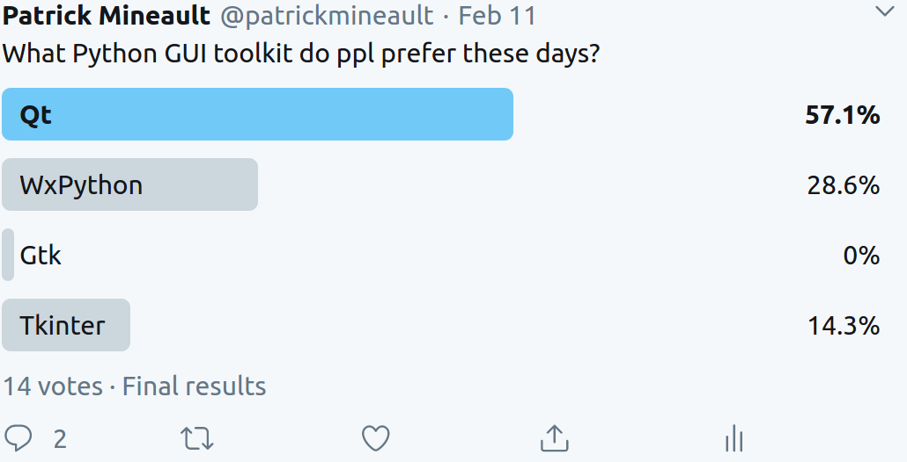

# Orienting yourself through Python

I was surprised by the amount of positive response to my [last article on transitioning away from Matlab](https://xcorr.net/2020/02/21/transitioning-away-from-matlab/). Many people are ready to switch - but they're facing some significant hurdles. One of the biggest things I've heard is that beginners get overwhelmed with the amount of choices they have to make with Python. That's normal! Python is open source, has a decentralized contribution model, and has been around for more than 25 years. So for everything that you can do one way in Matlab, there's at least 10 different ways of doing it in Python. Picking the best one is stressful! 

This is my rough guide to orienting yourself with Python. Don't read it all in one go, it will make your head spin! The goal is not to overwhelm you with information, but to have this information as as reference when you're ready to use it. The recommendations are based on my personal opinions and experiences. They're written with the intent of minimizing the amount of research and pain you'll have to go through as a beginner. Don't agree? Post in the comments! Feedback is a gift.

#### Which distribution should I choose?

The Python distribution on the python.org website *does not* include a lot of core packages needed for data science. It also does not include a package manager. A package manager allows you to automatically download and install a set of scripts and modules of a specific version - a package. People recommend using [the Anaconda distribution](https://www.anaconda.com/distribution/), which is more fully featured. It includes:

* Python.
* `ipython`, the interactive python console.
* The `conda` package manager. Note that conda and the Anaconda distribution are two different things.
* Many of the core packages needed for data science.
* An installer that sets your path correctly, which is especially important on Windows.

You should pick the [latest stable version of Python 3 that conda comes in, in its 64-bit incarnation](https://www.anaconda.com/distribution/). Python 2 has been deprecated for a number of years ago, and you should not be using it.

#### Which package manager should I use?

When you try to install packages like `tensorflow` and `pytorch`, you'll quickly find that there's often two ways to install the same thing, because there are two package managers that matter:

* `pip`: the lightweight package manager. Originally pip could only install Python things, but these days it can install non-Python system-wide dependencies to Python packages.
* `conda`: the heavy-duty package manager. It's not just for Python, it's for everything! This includes Python things with weird dependencies, R and Julia packages, text editors, etc.

Generally, packages will tell you how you should install them. Just follow the instructions. If there's two sets of instructions, you probably want to follow the first one. In general, the process is similar: open the command line, type in a command, confirm, and wait for the install to finish. I find generally that conda is slower but it can install a wider range of things.

#### Where should I install my packages?

When you install a package in Python, you can either install it in the base (or root) environment or in a custom  environment. 

> A virtual environment is a named, isolated, working copy of Python that that maintains its own files, directories, and paths so that you can work with specific versions of libraries or Python itself without affecting other Python projects. 

If you're coming from the Matlab world, you know all the annoyances that come with managing the path. Imagine removing the path and replacing it wholesale when you switch projects. That's sort of what environments do in Python. Another metaphor you might like is a virtual machine or a container. It's a little sandbox in which you can put packages. If you bonk your environment you delete it and create a new one. No need to reinstall your computer!

There's a few different environment managers, but since you installed Anaconda (above) and you have conda installed, you want to use `conda` environments. When you get started, you can put everything in the `base` environment. Later on, you'll find this limiting (maybe you'll have bonked your install after a bit), so you'll create another environment, perhaps called `py3`. Then later you might create one environment per project (with its own Github repo!). Packages that have very specific sets of dependencies will sometimes ask you to recreate an environment *exactly*. In that case, follow the instructions to the letter; the package probably needs an old version of a package or has esoteric system-wide dependencies that you will waste hours trying to track down. [One example is DeepLabCut](https://github.com/AlexEMG/DeepLabCut/blob/master/conda-environments/README.md).

#### Which packages should I install?

Many of the packages included by default in anaconda are your standard bread-and-butter for data science, including:

* matplotlib for plotting
* numpy for matrices
* scipy for signal processing
* pandas for dataframes
* sklearn for machine learning

Each of these packages has millions of users, they are very active, they're supported by grants and commercial entities. You can rely on them. I also list [well-supported packages for neuroscience](https://xcorr.net/2020/02/21/transitioning-away-from-matlab/) in the previous article. 

What about more esoteric needs? How do I intuit whether I'm going to waste a bunch of time on a package that doesn't work? Here are a few heuristics:



* People link more to well-maintained packages. The top result in a search engine is generally best.
* How many stars does it have on Github (1 in the above picture)? If it has one 1k+ stars - it's a very well used project. If it's smaller than 100
* Look on Github for the package. When is the last commit (2 in the above picture)? If it's more than a year, chances are this package is abandoned. This may make it difficult to install.
* When in doubt, ask! Ask your labmates, on Twitter, on your favorite Discourse or at a local meetup. Use whatever everybody else is using - this way, it will be easier to get support.

#### Which IDE should I use?

There's two categories of integrated development environment for Python:

1. Code editors. You edit code which you can run from inside the editor. They'll have a file explorer, variables explorer, a plotting window, a console window, a graphical debugger, etc. These programs can approximate more or less faithfully the experience you have with Matlab. In some cases offer many, many more features. These run as standalone programs on your computer.
2. Notebook editors. You edit a visual document consisting of cells that can be run in any arbitrary order. Plots are saved inline and code can be interspersed with formatted text and formulas. These run as program in your browser, and can connect to remote workers (Python doesn't have to be on your computer, it can be in the cloud).

I asked on Twitter what people use, and it's fairly evenly split. Many commented that they use both code editors and notebook editors in their day-to-day work. If I want to train a deep neural net, I might:

1. Write a script in a code editor, testing it on toy data with the built-in command line
2. Run the script inside of a terminal overnight
3. Analyze the results inside of a notebook the next day. 



There is a very good article that weighs all the different options - it's long! Here is my current hot take:

1. Code editors: [Spyder is the most bare-bones editor, and approximates Matlab well](https://www.spyder-ide.org/). It's a great starter IDE. I love Atom in general but I find [Hydrogen](https://nteract.gitbooks.io/hydrogen/docs/Installation.html)'s lack of a console limiting. I prefer [VSCode](https://code.visualstudio.com/) with [the Python extension](https://code.visualstudio.com/docs/languages/python). [PyCharm](https://www.jetbrains.com/pycharm/) is by far the most advanced editor, with intelligent inferences on your code and automated fixes that feel like magic. It can also be overwhelming because it has many features, and it also isn't free (a license is 89$ a year). If you spend 8 hours a day doing Python this might the editor for you.
2. Notebook editors: [Jupyterlab](https://jupyterlab.readthedocs.io/en/stable/) does everything jupyter does and more. [Colab](https://colab.research.google.com/notebooks/intro.ipynb#recent=true) adds sharing capabilities, but the biggest reason to use it is the [free GPU and TPU credits](https://cloud.google.com/tpu/docs/colabs) you can get with it.

#### Which GUI toolkit should I use?



I asked on Twitter recently, and it seems that many people are choosing [PyQt5](https://wiki.python.org/moin/PyQt) to build desktop applications. Qt has a very nice builder to graphically design your GUI, as well as code generators to eliminate writing your own boilerplate. wxPython is also well-loved for larger scale applications, while tkinter doesn't have quite all the knobs and options you'd want for a real app. 

#### PyTorch or Tensorflow?

That's a tough one! I've worked with both in a professional setting at Google and Facebook. As an end-user, [PyTorch](https://pytorch.org/) is generally considered to be easier to use. [Tensorflow](https://tensorflow.org) has a lot of support for advanced features, like probabilistic programming, and is used by downstream libraries for this reason, for example the up-and-coming PyMC4. If you use Tensorflow, you probably want to start with [Keras](https://keras.io/), which has a higher-level API.

#### What about plotting? How do I make nice figures?

[`matplotlib` is the package that most people start with](https://matplotlib.org/). Its API is very similar to Matlab, by design. It creates not very good attractive plots, by default, but [you can easily improve them by using seaborn's styling](https://seaborn.pydata.org/tutorial/aesthetics.html):

```python
import matplotlib.pyplot as plt
import seaborn as sns
sns.set()  # From now on matplotlib will use the seaborn theme.
```

Many other packages build on `matplotlib`, including:

* [`seaborn`](https://seaborn.pydata.org/), which includes a number of useful plot types, including violin plots and histograms.
* [`plotnine`](https://github.com/has2k1/plotnine), which implements the grammar of graphics (`ggplot2` in R).

There are a number of up-and-coming visualization libraries that are not using matplotlib under the hood. The one with the most support behind it is [plotly](https://github.com/plotly/plotly.py). It creates interactive plots that can be shared easily, includes support for other languages outside of Python, and is supported commercially by the plotly company. 

### Conclusion

Picking up Python can feel overwhelming as an outsider - so many decisions to make! I was endlessly picking through articles and doing comparison shopping when I was starting. Picking things others around you are using will help you get support when you're starting out. Ask around! Enjoy the ride! 